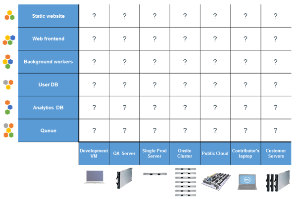
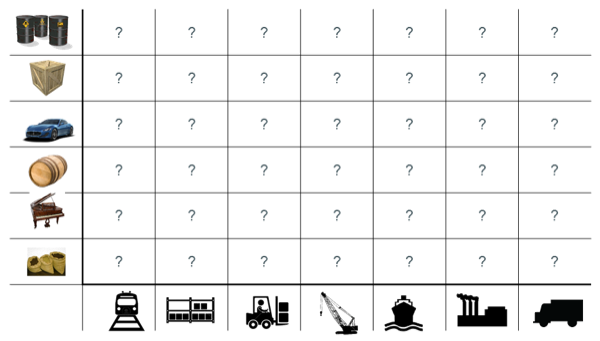
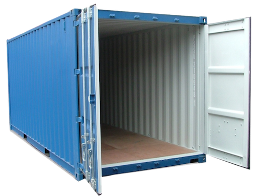
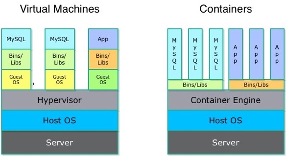
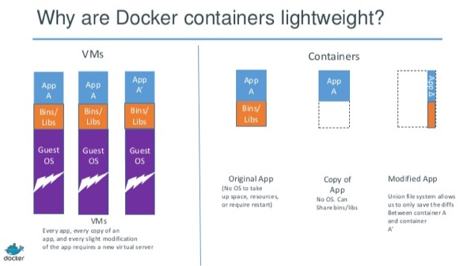
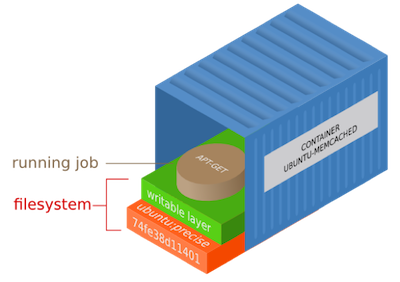
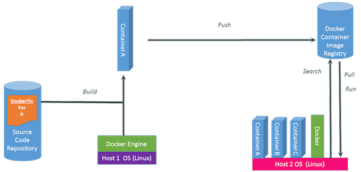
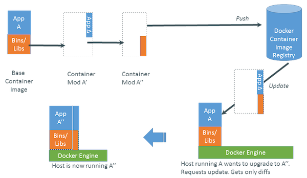
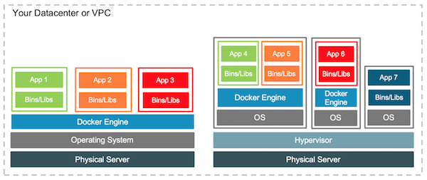
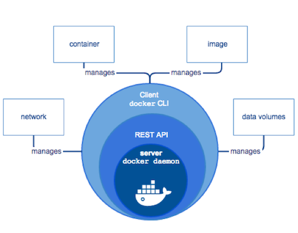

title: cnam-docker-2017
name: normal
layout: true
---
class: center, middle, inverse
# Docker Introduction - CNAM 2017

<!-- ---

# Access this presentation :

## Online version (HTML) :

[http://dduportal.github.io/presentations/mixit-2015-devbox-docker](http://dduportal.github.io/presentations/mixit-2015-devbox-docker)

Proudly powered by [RemarkJS](https://github.com/gnab/remark)

## Offline version (PDF) :

[http://dduportal.github.io/presentations/mixit-2015-devbox-docker/mixit-2015-devbox-docker.pdf](http://dduportal.github.io/presentations/mixit-2015-devbox-docker/mixit-2015-devbox-docker.pdf)

Proudly exported with [Deck2PDF](https://github.com/melix/deck2pdf) -->

---

# Whoami :

* Damien DUPORTAL
  - Training Engineer @ CloudBees depuis 1 an
  - 6 ans à Atos Worldline: Production, Dev, Training, etc.
  - Intervenant ponctuel à EPSI, ENSG, CNAM
  - Docker mentor, depuis v0.3

* Contact:
  - Mail/Hangouts: damien.duportal@gmail.com
  - Twitter: @DamienDuportal
  - Github: dduportal

---
class: center, middle, inverse
# Who are you ?

---

# Agenda:

1. Docker: 101
2. Docker: bases
3. Docker avancé
4. Docker écosystème

.footer[Ces slides ont du contenu piqué de Docker http://www.slideshare.net/dotCloud]

---
class: center, middle, inverse

# Docker: 101

---


.left-column[
# Docker: 101
## Pourquoi Docker ?

]
.right-column[

# Pourquoi Docker ?

Quel est le problème que nous essayons de résoudre ?

.center[]

]

---

.left-column[
# Docker: 101
## Pourquoi Docker ?

]
.right-column[

# "Matrix from Hell"

Problème de temps **exponentiel**

.center[]

]

---

.left-column[
# Docker: 101
## Pourquoi Docker ?

]
.right-column[

# Déjà vu ?

L'IT n'est pas la seule industrie à résoudre des problèmes...

.center[]

]

---

.left-column[
# Docker: 101
## Pourquoi Docker ?

]
.right-column[

# Solution: Le container intermodal

"Separation of Concerns"

.center[]

]


---

.left-column[
# Docker: 101
## Pourquoi Docker ?
## Comment ça marche ?
]
.right-column[

# Comment ça marche ?

.center["Virtualisation **Légère**"]

.center[]

]

---

.left-column[
# Docker: 101
## Pourquoi Docker ?
## Comment ça marche ?
]
.right-column[

# Comment ça marche ?

"Pourquoi **Léger**" ?

.center[]

]

---

.left-column[
# Docker: 101
## Pourquoi Docker ?
## Comment ça marche ?
]
.right-column[

# Comment ça marche ?

* Linux Kernel requis (ou presque... Windows...)
* Linux containers: "super" chroot
  - "Namespacing": isolation (users, réseau, PIDs ...)
  - "Control Groups": gestion et contrôle (CPU, mem ...)
* Système de fichier de type "Union File System"
* Process **PID 1** et ses enfants _dans_ le container


.center[]


]

---

.left-column[
# Docker: 101
## Pourquoi Docker ?
## Comment ça marche ?
## Docker workflow
]
.right-column[

# Docker workflow

Workflow Docker basique:

.center[]

]

---

.left-column[
# Docker: 101
## Pourquoi Docker ?
## Comment ça marche ?
## Docker workflow
]
.right-column[

# Exemple: mise à jour d'une application

.center[]

]

---

.left-column[
# Docker: 101
## Pourquoi Docker ?
## Comment ça marche ?
## Docker workflow
## Docker Inc.
]
.right-column[

# Docker Inc.

* Fondé à Paris en 2008 par Solomon Hykes
* Migre à San Fransisco en 2009
* 2013: Open-source le projet Docker
* 2014: dotCloud devient Docker
* 2016: 1 milliard de levée de fond

# Docker Project

* Originellement écrit en Python au sein de dotCloud
* Ré-écrit en **Golang** et _ouvert_ en 2013 après une "PyCon"
* Open Source - [Apache licence](https://github.com/docker/docker/blob/master/LICENSE)
* Disponible sur Github: https://github.com/docker/docker
* ~22 K commits, +1400 contributeurs

]

---

.left-column[
# Docker: 101
## Pourquoi Docker ?
## Comment ça marche ?
## Docker workflow
## Docker Inc.
## Résumé
]
.right-column[

# Résumé

_Objectif de Docker :_

.center[]

]

---

.left-column[
# Docker: 101
## Pourquoi Docker ?
## Comment ça marche ?
## Docker workflow
## Docker Inc.
## Résumé
]
.right-column[

# Container are NOT VMs

"Separation of concerns": 1 "tâche" par containeur

.center[]

]

---

.left-column[
# Docker: 101
## Pourquoi Docker ?
## Comment ça marche ?
## Docker workflow
## Docker Inc.
## Résumé
]
.right-column[

# VM et containeurs non exclusifs mutuellement

.center[]

]

---
class: center, middle, inverse

# Docker: Bases

## Un peu d'action !

<!-- // http://play-with-docker.com/ -->

---

.left-column[
# Docker: 101
# Docker: bases
## Obtenir Docker
]
.right-column[

# Obtenir Docker

* Un bac à sable est disponible sur http://play-with-docker.com/
  - Validez le Captcha
  - Vous avez 4 heures pour jouer avec des "instances Docker"
  - Cliquez sur le bouton "Add a new instance"
  - Une machine démarre, vous avez accès à la ligne de commande
* Page officielle d'installation: https://www.docker.com/products/overview
  - Linux: Utilisez votre gestionnaire de paquetage
  - MacOS and Windows: des installateurs "natifs" sont proposés
  - Vous pouvez utiliser une VM ou un service préconfiguré dans le Cloud de votre choix (Amazon, Azure, OVH, etc.)

]
---

.left-column[
# Docker: 101
# Docker: bases
## Obtenir Docker
## Vocabulaire
]
.right-column[

# Vocabulaire

* **Docker Image :** Modèle (template) de base, représentant une application

* **Docker Container :** Unité d'exécution standard, instanciée depuis une image

* **Docker Engine :** Service responsable de créer, déployer et exécuter les containeurs Docker sur un host physique, virtuel, distant ou local

* **Registry Service (Docker Hub or Docker Trusted Registry) :**
Service de stockage et de distribution des images

]

---

.left-column[
# Docker: 101
# Docker: bases
## Obtenir Docker
## Vocabulaire
## Docker Images
]
.right-column[

# Docker Images

* **Docker Image :** c'est le modèle de base

* Nommage: `[REGISTRY/][NAMESPACE/]NAME[:TAG|@DIGEST]`
  - Pas de Registre ? Défaut: `registry.hub.docker.io`
  - Pas de Namespace ? Défaut: `library`
  - Pas de tag ? Valeur par défaut: `latest` - ATTENTION !
  - Digest: signature unique basée sur le contenu

```shell
$ docker images

$ docker pull alpine:3.4
$ docker images # Quelles différences ?

$ docker pull alpine:latest
$ docker pull jfrog-docker-reg2.bintray.io/jfrog/artifactory-oss
$ docker images # Quelles différences ?

$ docker tag alpine:3.4 my-alpine:3.4.0-local
$ docker tag jfrog-docker-reg2.bintray.io/jfrog/artifactory-oss \
  artifactory-local
$ docker images # Quelles différences ?
```

]

---

.left-column[
# Docker: 101
# Docker: bases
## Obtenir Docker
## Vocabulaire
## Docker Images
## Docker Containers
]
.right-column[

# Docker Containers 1/2

* **Docker Containers :** c'est l'unité d'exécution, instanciée depuis une image.

```shell
$ docker ps
$ docker run alpine:3.4 echo "Bonjour depuis un containeur"

$ cat /etc/os-release
$ docker run -ti alpine:3.4 /bin/sh
#/ cat /etc/os-release
#/ whoami
#/ ps aux
#/ exit

$ docker run -d nginx:1.10-alpine
$ docker run -d --name webserver-1 nginx:1.10-alpine
$ docker ps

$ docker inspect nginx:1.10-alpine  # IMAGE
$ docker inspect webserver-1        # Container

# Explorons d'autres options
$ docker ps -a
$ docker ps -q
```

]
---

.left-column[
# Docker: 101
# Docker: bases
## Obtenir Docker
## Vocabulaire
## Docker Images
## Docker Containers
]
.right-column[

# Docker Containers 2/2

```shell
# Cycle de vie
$ docker run -d --name webserver-2 nginx:1.10-alpine
$ docker ps
$ docker stop webserver-2
$ docker ps
$ docker start webserver-2
$ docker ps
$ docker kill webserver-2
$ docker ps

# Accès au containeur
$ docker run -d --name db-server postgres
$ docker ps

$ ps faux

$ docker exec db-server ps faux

$ docker exec -ti db-server sh
root@5da9f26d72c3:/# ps faux
root@5da9f26d72c3:/# exit

```

]

---

.left-column[
# Docker: 101
# Docker: bases
## Obtenir Docker
## Vocabulaire
## Docker Images
## Docker Containers
## Docker Network
]
.right-column[

# Docker Network

* Docker utilise du **NAT** par défaut:

```shell
$ docker run -d --name webserver-3 -p 8000:80 nginx:1.10-alpine

$ docker inspect --format '{{ .NetworkSettings.IPAddress }}' \
  webserver-3

# Access the webserver using the private network
$ curl -I http://172....:80

$ docker port webserver-3
$ docker ps

$ curl -I http://localhost:8000

# Let Docker manage this
$ docker run -d --name webserver-4 -P nginx:1.10-alpine
$ docker port webserver-3
$ curl -I http://localhost:<PORT FOUND>

# Try with your public IP
$ curl ifconfig.co # Or use Play With Docker IP

```

]

---

.left-column[
# Docker: 101
# Docker: bases
## Obtenir Docker
## Vocabulaire
## Docker Images
## Docker Containers
## Docker Network
]
.right-column[

# Basic Network Summary

.center[]

]

---

.left-column[
# Docker: 101
# Docker: bases
## Obtenir Docker
## Vocabulaire
## Docker Images
## Docker Containers
## Docker Network
## Docker Volumes
]
.right-column[

# Docker Volumes

* Quand le cycle de vie de la donnée est différent de celui du containeur
  - Application HTML/PHP/JS - Serveur Web
  - Données BDD - Serveur de BDD

```shell
$ docker run alpine ls -l /app
$ docker run --volume /app alpine ls -l /app

$ docker run -d -v /application --name ws-vol nginx:1.10-alpine
$ docker inspect ws-vol | grep -i -A10 Mounts

$ touch <SOURCE_DIR>/_data/toto # Sudo est peut être nécessaire
$ docker exec -ti ws-vol ls -l /application/toto

# Pour certain cas d'usages, mais ATTENTION ICI
$ pwd
$ echo "ok" > file.txt
$ ls -l
$ docker run -ti -v $(pwd):/partage alpine ls -l /partage

```

]

---

.left-column[
# Docker: 101
# Docker: bases
## Obtenir Docker
## Vocabulaire
## Docker Images
## Docker Containers
## Docker Network
## Docker Volumes
## Nettoyage
]
.right-column[

# Un peu de nettoyage

```shell
$ docker run -d --name ws-trash nginx:1.10-alpine
$ docker kill ws-trash
$ docker rm ws-trash

$ docker run -d -v /app --name ws-trash-2 nginx:1.10-alpine
$ docker kill ws-trash-2
$ docker rm -v ws-trash-2

$ docker rmi nginx:alpine

# DALECK / TERMINATOR MODE
$ docker ps -q | xargs docker kill

$ docker ps -a -q | xargs docker rm -v

$ docker images -q | xargs docker rmi -f
```

]
---

class: center, middle, inverse

# Docker avancé

---

.left-column[
# Docker: 101
# Docker: bases
# Docker avancé
## Plateforme
]
.right-column[

# Plateforme : Vue globale

.center[]


]

---

.left-column[
# Docker: 101
# Docker: bases
# Docker avancé
## Plateforme
]
.right-column[

# Plateforme : Architecture

.center[]


]

---

.left-column[
# Docker: 101
# Docker: bases
# Docker avancé
## Plateforme
]
.right-column[

# Plateforme : Docker Hub

.center[]

]

---

.left-column[
# Docker: 101
# Docker: bases
# Docker avancé
## Plateforme
]
.right-column[

# Plateforme : Docker Cloud

.center[]

]

---

.left-column[
# Docker: 101
# Docker: bases
# Docker avancé
## Plateforme
## Dockerfile
]
.right-column[

# Dockerfile: Fabriquer ses propres images

* `Dockerfile`: recette pour fabriquer son image

```Dockerfile
FROM debian:jessie
MAINTAINER Damien DUPORTAL <damien.duportal@gmail.com>

RUN apt-get update && apt-get install -y nginx

VOLUME ["/tmp","/app"]

EXPOSE 80

ENTRYPOINT ["/usr/sbin/nginx"]
CMD ["-g","daemon off;"]

```


]
---

.left-column[
# Docker: 101
# Docker: bases
# Docker avancé
## Plateforme
## Dockerfile
]
.right-column[

# Dockerfile: Fabriquer ses propres images

* `docker build`: commande pour fabriquer une **image** depuis un `Dockerfile`

```shell
$ mkdir web && cd ./web
$ vi Dockerfile # Utilisez le Dockerfile de la slide précédente
$ docker build ./

$ cd ..
$ docker build -t web:1.0.0 ./web/

$ docker run -d -P --name my-web-1 web:1.0.0
# Affichez la page avec docker port (..) et curl (...)

$ vi ./web/Dockerfile
# Ajoutez la ligne ci-dessous
# RUN echo Hello > /var/www/html/index.nginx-debian.html

$ docker build -t web:1.1.0 ./web/
$ docker run -d -P --name my-web-2 web:1.1.0
# Affichez la nouvelle page avec docker port (..) et curl (...)

```


]

---

.left-column[
# Docker: 101
# Docker: bases
# Docker avancé
## Plateforme
## Dockerfile
]
.right-column[

# Comment ça marche ? 1/2

* Pas dans un volume ? => Union File System (AUFS/BTRFS/DeviceMapper...)

* Les images "lecture seule": les écritures se font dans une nouvelle couche ("Writeable Layer")

.center[]

]

---

.left-column[
# Docker: 101
# Docker: bases
# Docker avancé
## Plateforme
## Dockerfile
]
.right-column[

# Comment ça marche ? 2/2

* On peut "committer" un "writeable layer": il devient lecture seule

* Une image est donc une collection ordonnée de "layers" en lecture seule

* Une instruction Dockerfile == 1 "layer" du Union FS, commité **automatiquement**

.center[]

]

---

.left-column[
# Docker: 101
# Docker: bases
# Docker avancé
## Plateforme
## Dockerfile
## Partages
]
.right-column[

# Partages: Réseau 1/2

* Comment faire dialoguer 2 containeurs sans publier leurs ports
  - Lien Serveur d'application <-> Base de données

* Example avec Redis:

```shell
$ docker pull redis
$ docker inspect redis | grep -i -A2 expose
# Quel ports sont "exposés" ?

$ docker run -d --name redissrv redis # Pas de port publié

$ docker run -ti --link redissrv:dbserver redis env

$ docker run -ti --link redissrv:dbserver redis bash
root@CONTAINER $/ cat /etc/hosts

$ docker run -ti --link redissrv:dbserver \
  redis redis-cli -h dbserver -p 6379

```

]

---

.left-column[
# Docker: 101
# Docker: bases
# Docker avancé
## Plateforme
## Dockerfile
## Partages
]
.right-column[

# Partages: Réseau 2/2

* Comment gérer du réseau qui change (adresse, port, etc.) ?
  - Command `docker network`
  - Drapeau `--net` pour la commande `docker run`

```shell
$ docker network --help
$ docker network ls

$ docker network create db-net-1
$ docker network ls # Différences ?

$ docker run -d --net=db-net-1 --name redissrv-2 redis
# Pas de port publié

$ docker network inspect db-net-1

$ docker run -ti --rm --net=db-net-1 redis cat /etc/hosts
# Plus de ligne référençant le serveur

$ docker run -ti --rm --net=db-net-1 redis \
  redis-cli -h redissrv-2 -p 6379
# Les noms des containeurs sont gérées dans un serveur DNS
# DNS: Dynamique !

```

]
---

.left-column[
# Docker: 101
# Docker: bases
# Docker avancé
## Plateforme
## Dockerfile
## Partages
]
.right-column[

# Partages: Volumes 1/2

* Comment partager des volumes entre des containeurs ?
  - Le containeur initial doit déclarer un volume
  - Utiliser le drapeau `--volumes-from`

```shell
$ docker run -d -v /app --name pere nginx:1.10-alpine

$ docker run --rm -ti --volumes-from pere debian:jessie bash
root@CONTAINER$ echo "Hello" > /app/hello.txt
root@CONTAINER$ exit

$ docker exec -ti pere sh
root@pere$ cd /app
root@pere$ ls -l
root@pere$ cat /app/foo
root@pere$ exit
```

]

---

.left-column[
# Docker: 101
# Docker: bases
# Docker avancé
## Plateforme
## Dockerfile
## Partages
]
.right-column[

# Partages: Volumes 2/2

* Tout comme pour les réseaux, docker peut gérer les volumes "à part"
  - Commande `docker volume`

```shell
$ docker volume --help

$ docker volume ls

$ docker volume create --name=shared-data

$ docker volume ls

$ docker run --rm -ti -v shared-data:/partage alpine sh
#/ echo "hello again" > /partage/fichier.txt
#/ exit

$ docker run --rm -ti -v shared-data:/DATA debian:jessie \
  cat /partage/fichier.txt
$ docker run --rm -ti -v shared-data:/DATA debian:jessie \
  cat /DATA/fichier.txt
```

]

---

.left-column[
# Docker: 101
# Docker: bases
# Docker avancé
## Plateforme
## Dockerfile
## Partages
]
.right-column[

# Partages: Résumé

* Docker peut gérer les réseaux et volumes de fichiers
* AVANTAGES:
  - Convention
  - Pas de configuration à maintenir
  - Portabilité

]

---
class: center, middle, inverse

# Docker: Écosystème


---

.left-column[
# Docker: 101
# Docker: bases
# Docker avancé
# Docker: Écosystème
## Compose
]
.right-column[

# Compose 1/2

* Compose est un client Docker, qui va exécuter les commandes pour vous
* Source: fichier au format YAML:

```
version: "2"

volumes:
  db-data:

networks:
  front-tier:
  back-tier:

services:
  vote:
    build: ./vote
    ports:
      - "5000:80"
    networks:
      - front-tier
      - back-tier

  redis:
    image: redis:alpine
    volumes:
      - db-data:/var/redis
    networks:
      - back-tier
```

]

---

.left-column[
# Docker: 101
# Docker: bases
# Docker avancé
# Docker: Écosystème
## Compose
]
.right-column[

# Compose 2/2

* Commande `docker-compose`
* Gestion intelligente des cycles de vie:
  - Mise à jour d'une image sans toucher au contenu du data volume
* Scaling des containeurs
  - Ne gère PAS le routage pour vous !

* Futur: intelligence vers le Docker Daemon avec la commande `docker service`
  - Conversion des YAML vers le Docker Daemon

]

---

.left-column[
# Docker: 101
# Docker: bases
# Docker avancé
# Docker: Écosystème
## Compose
##
]
.right-column[

# Swarm

* Commande `docker-compose`
* Gestion intelligente des cycles de vie:
  - Mise à jour d'une image sans toucher au contenu du data volume
* Scaling des containeurs
  - Ne gère PAS le routage pour vous !

* Futur: intelligence vers le Docker Daemon avec la commande `docker service`
  - Conversion des YAML vers le Docker Daemon

]
